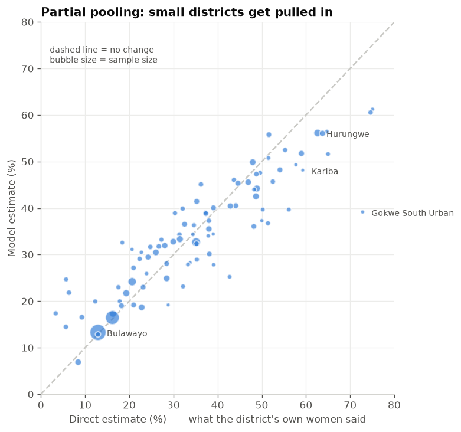
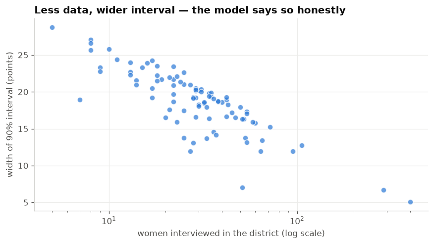

# zw-marriage-risk

**Where should child marriage prevention programmes go in Zimbabwe?**
District-level prevalence estimates with honest uncertainty.

[](https://github.com/Gamuchirai-Magamba/zw-marriage-risk/actions/workflows/ci.yml)
[](https://www.python.org)
[](LICENSE)

### 🗺️ [Open the map](https://zw-marriage-risk-4utpnywt5sqnwhn4ay5bur.streamlit.app/) · [API docs](https://zw-marriage-risk.onrender.com/docs) · [Model card](MODEL_CARD.md)

---


---

## The problem

**One in three Zimbabwean girls marries before she turns 18.** That figure has barely
moved in a decade — 32.4% in the 2015 DHS, 33.7% in the 2019 MICS.

An organisation with funding for, say, sixty wards has to choose where to work.
Zimbabwe has 91 districts and over 1,900 wards. National statistics cannot answer
that question, and neither can provincial ones — a province like Mashonaland West
holds two million people.

So programmes are targeted largely on judgement.

## The methodological problem

The obvious fix is to compute a rate per district. **It does not work.**

```
Direct district estimates (weighted average of each district's own respondents):

  range                          3.3%  to  75.1%
  districts with under 20 women      23 of 91
  smallest district                   5 women
```

Look at the smallest districts:

| district | women | married | "rate" | give or take |
|---|---|---|---|---|
| kariba | 5 | 3 | 59.3% | **±22 points** |
| gokwe south urban | 8 | 5 | 72.8% | ±16 points |
| mbire | 11 | 8 | 75.1% | ±13 points |

Kariba's five respondents could plausibly represent anything from 15% to 100%. And
notice that the districts ranked *worst* are largely the ones sampled *least* — small
samples produce extreme numbers. **A map built on this would send money wherever the
survey happened to be thinnest.**

## The approach

A **multilevel logistic regression** with a random intercept per district, fitted on
both surveys pooled (3,487 women aged 20–24, 839 clusters, all 91 districts).

Each district gets its own estimate, but those estimates are drawn from a shared
distribution. The consequence is **partial pooling**:

- a district with 399 respondents moves the model, so its estimate stays close to its
  own data and its interval is narrow
- a district with 5 respondents cannot, so its estimate is pulled toward districts
  that resemble it — and its interval stays wide

Nothing is discarded and nothing is invented. How much pooling happens is decided by
the data, through the estimated between-district variance.



*Every district. Bubble size is sample size. Points on the dashed line did not move;
the small ones fell away from it.*

| district | n | direct | model | 90% interval |
|---|---|---|---|---|
| kariba | 5 | 59.3% | **48.1%** | 34 – 63 |
| gokwe south urban | 8 | 72.8% | **39.2%** | 27 – 53 |
| bulawayo | **399** | 12.9% | **13.3%** | 11 – 16 |

Gokwe South Urban fell 34 points. Bulawayo moved 0.4.

## Does it beat guessing?

Whole districts held out, so the model has never seen them:

| | Mean absolute error |
|---|---|
| **Model** | **11.07 points** |
| Assume the national rate | 13.91 points |
| | **20% better** |

Real, and modest. Predicting an unseen district from satellite context and population
composition alone is hard, and the honest thing is to say so.

Correlation between interval width and 1/n: **0.71** — the model is less certain
exactly where it has less data.



## ⚠️ The model is least accurate for the poorest women

| Wealth quintile | Actual | Predicted | Brier |
|---|---|---|---|
| **Poorest** | 51.8% | 54.3% | **0.226** |
| Poorer | 48.2% | 44.6% | 0.220 |
| Middle | 36.5% | 36.5% | 0.211 |
| Richer | 31.8% | 26.4% | 0.197 |
| Richest | 12.8% | 15.4% | **0.106** |

**More than twice the error for the poorest as for the richest** — and those are
precisely the girls this tool exists to help.

The mechanism is that outcomes among the poorest are near 50/50, which is inherently
the hardest thing to predict, while among the richest the answer is almost always
"no". That is an explanation, not an excuse. **The practical consequence is that
estimates for the poorest districts deserve the widest caution.**

This is stated here, in the [model card](MODEL_CARD.md), in the API's `/meta`
endpoint, and in the app itself. Burying it would be the worst thing this project
could do.

## 🚫 What this does not do

**It does not, and will not, estimate risk for an individual girl.**

Every number here describes a *place*. Applying it to a person would be statistically
invalid and actively harmful — inviting stigma and targeting against children who
would have been fine.

The API has **no endpoint that accepts a person's attributes**. Not disabled, not
gated — absent. [There is a test asserting the absence](tests/test_api.py), so that
anyone adding one later has to consciously delete it.

## Running it

```bash
pip install -e ".[dev,app,viz]"

# obtain the microdata yourself - see data/README.md - then:
cp paths.example.py paths.py     # edit ROOT for your machine

python show_the_problem.py    # why direct estimates fail
python fit_model.py           # fit, estimate, shrinkage chart
python explain_model.py       # drivers + fairness audit
python export_app_data.py     # freeze output for the app

python -m pytest              # 41 tests
```

Then either:

```bash
uvicorn zw_marriage_risk.api:app --reload   # API at :8000/docs
python -m streamlit run app.py              # map at :8501
docker build -t zwmr . && docker run -p 8000:8000 zwmr
```

## How it is put together

```
microdata  →  export_app_data.py  →  app_data/*.json  →  API + map
(private)     (your laptop)          (derived, safe)      (deployed)
```

**The deployed service has no dependency on the microdata**, which matters twice
over. DHS and MICS data cannot be redistributed, and a container with survey
microdata inside it *is* redistribution. It is also better engineering: the API
imports nothing heavier than FastAPI, cold start is milliseconds, and the boundary
file shrinks from 16 MB to 342 KB.

```
src/zw_marriage_risk/
├── data.py       pool both surveys, attach districts, direct estimates
├── model.py      the multilevel model, estimates, cross-validation
├── explain.py    per-district drivers, fairness audit, calibration
└── api.py        FastAPI service
app.py            Streamlit map
```

Built on [`zw-gender-data`](https://github.com/Gamuchirai-Magamba/zw-gender-data),
which handles the survey loading and the district assignment.

## Limitations

Fuller treatment in the [model card](MODEL_CARD.md). The ones that matter most:

- **The data is from 2015 and 2019.** The 2023–24 DHS microdata is not yet public.
  These estimates describe the recent past.
- **Least accurate for the poorest**, as above.
- **Variational Bayes understates uncertainty.** Treat the intervals as a floor.
  MCMC via PyMC is the upgrade path.
- **Calibration compresses toward the middle** — the top band is under-stated by
  about 4 points. Characteristic of a shrinkage estimator; isotonic recalibration
  would help.
- **Association, not causation.** Education is by far the strongest predictor, but
  causation runs both ways: leaving school raises marriage risk, and impending
  marriage causes girls to leave school. This model cannot separate them.
- **One coefficient I cannot yet explain.** Travel time to the nearest city is
  *negatively* associated with child marriage. Probably geography rather than
  isolation — Matabeleland is both remote and low-prevalence — but it is flagged,
  not asserted.
- **Districts are not wards.** Better than provinces; still coarser than where
  programmes actually operate.

## Data

| Source | Access |
|---|---|
| Zimbabwe DHS 2015 | [dhsprogram.com](https://dhsprogram.com), free registration |
| Zimbabwe MICS 2019 | [mics.unicef.org](https://mics.unicef.org), free registration |
| District boundaries (91) | MICS 2019 GIS package |

Both used under registered access. **Microdata is not redistributed** — this
repository contains code and district-level aggregates only. See
[`data/README.md`](data/README.md) to obtain it yourself.

## Citation

> Zimbabwe Demographic and Health Survey 2015. ZIMSTAT and ICF International.
> Zimbabwe Multiple Indicator Cluster Survey 2019, MICS6. ZIMSTAT and UNICEF Zimbabwe.

## License

MIT — see [LICENSE](LICENSE).
